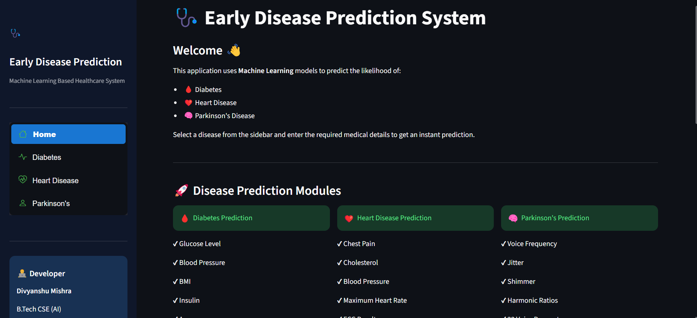
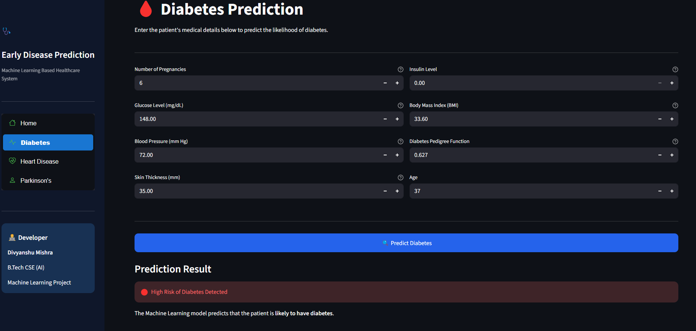
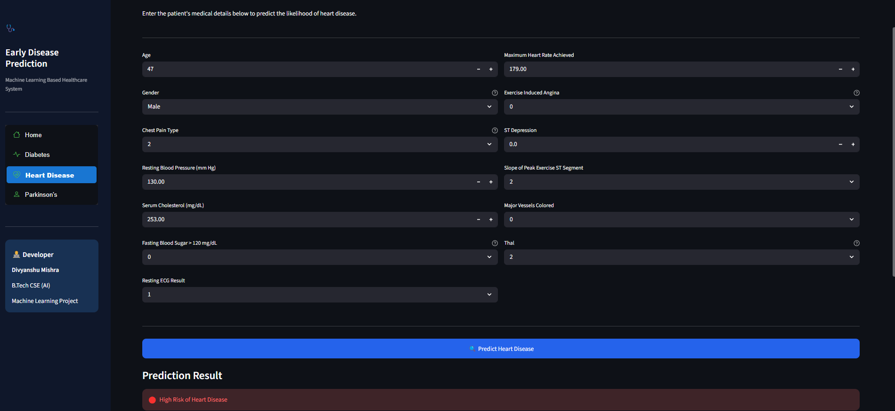
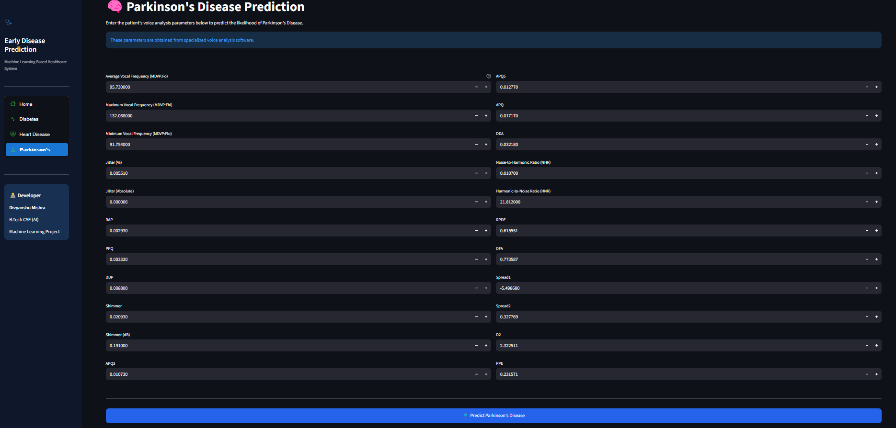

# 🩺 Early Disease Prediction System

A Machine Learning-based web application built using **Python**, **Streamlit**, and **Scikit-learn** that predicts the likelihood of:

- 🩸 Diabetes
- ❤️ Heart Disease
- 🧠 Parkinson's Disease

The application provides an easy-to-use interface where users can enter medical information and receive instant disease predictions using trained Machine Learning models.

---

## 🚀 Live Demo

🌐 **Deployment:** **Coming Soon** *(  https://earlydiseaseprediction-qxyyg8dsvgpi3956yvxaw9.streamlit.app/  )*

Example:

```text
https://your-app-name.streamlit.app
```

---

## 🚀 Features

- 🩸 Diabetes Prediction
- ❤️ Heart Disease Prediction
- 🧠 Parkinson's Disease Prediction
- 📊 User-Friendly Dashboard
- 🤖 Machine Learning Models
- ⚡ Fast Predictions
- 🎨 Modern Streamlit Interface
- 📚 Educational Medical Information

---

## 🛠 Technologies Used

- Python
- Streamlit
- Scikit-learn
- NumPy
- Pandas
- Pickle

---

## 📂 Project Structure

```text
Early_Disease_Prediction/
│
├── app.py
├── README.md
├── requirements.txt
│
├── models/
│   ├── diabetes_model.pkl
│   ├── heart_model.pkl
│   └── parkinson_model.pkl
│
├── views/
│   ├── home.py
│   ├── diabetes.py
│   ├── heart.py
│   └── parkinson.py
│
├── utils/
│   ├── model_loader.py
│   └── styles.py
│
├── assets/
│
└── screenshots/
    ├── home.png
    ├── diabetes.png
    ├── heart.png
    └── parkinson.png
```

---

## ▶️ Run Locally

Clone the repository

```bash
git clone <repository-url>
```

Move into the project folder

```bash
cd Early_Disease_Prediction
```

Install dependencies

```bash
pip install -r requirements.txt
```

Run the application

```bash
streamlit run app.py
```

---

## 📸 Screenshots

### 🏠 Home Page



---

### 🩸 Diabetes Prediction

*Sample input with prediction result.*



---

### ❤️ Heart Disease Prediction

*Sample input with prediction result.*



---

### 🧠 Parkinson's Disease Prediction

*Sample input with prediction result.*



---

## ⚠ Disclaimer

This application is developed for **educational purposes only**.

The predictions generated by the Machine Learning models should **not** be considered a replacement for professional medical advice, diagnosis, or treatment.

Always consult a qualified healthcare professional for medical decisions.

---

## 👨‍💻 Developer

**Divyanshu Mishra**

B.Tech Computer Science & Engineering (Artificial Intelligence)

### 🌐 Connect with Me

- **GitHub:** https://github.com/Divyanshu-T-1
- **LinkedIn:** https://www.linkedin.com/in/divyanshu-mishra-dev/

---

⭐ If you found this project useful, consider giving it a star on GitHub.